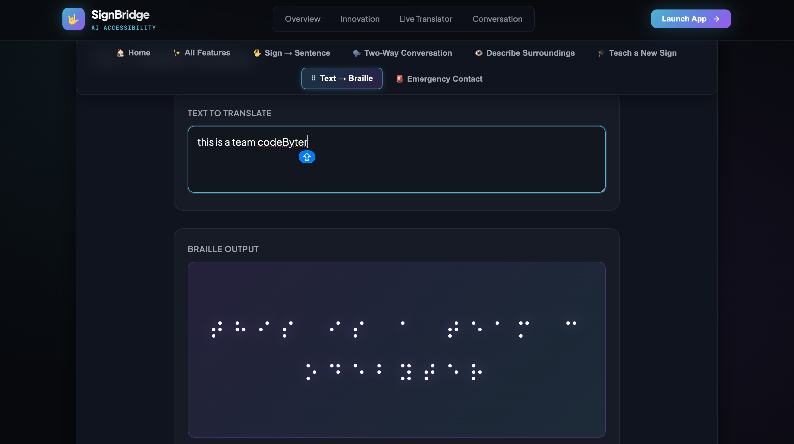
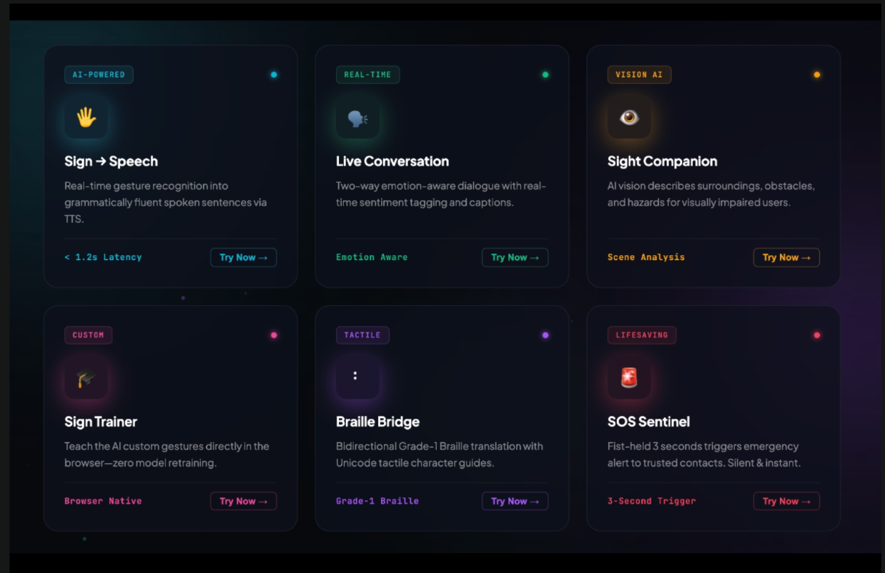
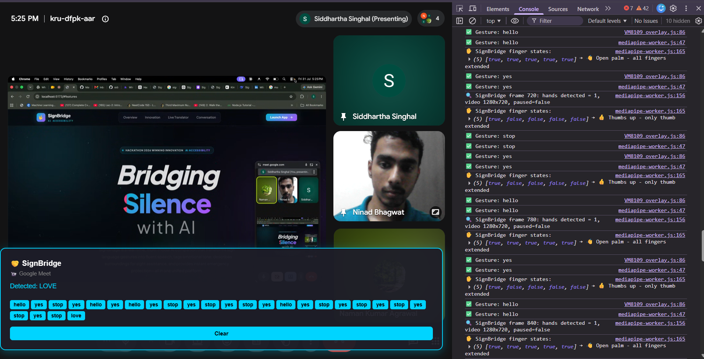

# SignBridge

### Submission for Synaptrix

## Problem Statement Chosen

**Domain:** SignBridge

**Problem Statement:** AI Companion for Real-Time Communication & Navigation

---

## Team

**Team Name:** Code Byter

---

## Our Solution

SignBridge is an AI accessibility companion that helps deaf, hard-of-hearing, and visually-impaired users communicate and navigate in real time. It turns hand signs into spoken sentences and vice versa for two-way conversation, describes a user's surroundings out loud for the visually impaired, converts typed text into Braille, and lets a fist held for three seconds trigger a silent emergency alert to a trusted contact. A companion Chrome extension brings the same live sign-to-caption interpretation directly into Google Meet calls, so the experience isn't limited to our own app. Everything runs client-side wherever possible (hand tracking happens fully in the browser), keeping latency low and privacy high.

---

## AI Component

### What AI is used
- **Google MediaPipe Hands** (on-device landmark detection) for gesture recognition
- **NVIDIA NIM API** for LLM inference:
  - `minimaxai/minimax-m3` for language tasks
  - `meta/llama-3.2-11b-vision-instruct` for vision tasks

### What it does in our app
- **MediaPipe** extracts 21 hand landmarks per frame in the browser and our own normalization/classification logic (`src/lib/landmarks.ts`) turns them into recognized signs.
- **MiniMax-M3** (via NVIDIA NIM) turns a buffered sequence of recognized signs into a grammatically fluent spoken sentence, and powers the emotion-aware two-way conversation captions.
- **Llama-3.2-11B-Vision** (via NVIDIA NIM) looks at a captured camera frame and describes the surroundings, obstacles, and hazards out loud for the "Sight Companion" feature.

### Why we chose this approach
Running hand detection on-device with MediaPipe keeps sign recognition fast (sub-1.2s) and works offline without sending video to a server. NVIDIA NIM gave us a free tier with both a fast text model and a vision-capable model behind one API, which let us cover sentence generation, emotion tagging, and scene description without stitching together multiple providers.

---

## Tech Stack

- **Frontend:** React, TypeScript, Vite
- **Backend:** Node.js, Express
- **AI/ML:** Google MediaPipe Tasks Vision (Hands), NVIDIA NIM API (MiniMax-M3 LLM, Llama-3.2-11B-Vision)
- **Database/Storage:** Browser-local storage (custom trained signs, emergency contact) — no external database
- **Other tools/APIs:** Web Speech API (text-to-speech and speech-to-text), Chrome Extension APIs (Manifest V3) for the Google Meet live-captioning extension

---

## Features Implemented

### Core Requirements
- ✅ **Sign → Sentence:** real-time gesture recognition into spoken sentences (TTS)
- ✅ **Two-Way Conversation:** emotion-aware speech-to-sign and sign-to-speech dialogue
- ✅ **Describe Surroundings:** AI vision scene description for visually impaired users
- ✅ **Text → Braille:** bidirectional Grade-1 Braille translation

### Bonus Features
- ✅ **Teach a New Sign:** browser-native custom gesture trainer, no model retraining required
- ✅ **Emergency Contact (SOS Sentinel):** silent 3-second fist-hold triggers an alert to a trusted contact
- ✅ **Chrome Extension:** live sign-to-caption overlay for Google Meet calls

---

## How to Run This Project

```bash
# Clone the repo
git clone https://github.com/siddhartha0132/SignBridge.git
cd SignBridge

# Install dependencies
npm install

# Copy the example env file and fill in your own keys
cp .env.example .env
# Edit .env and add your NVIDIA_API_KEY (free tier at https://build.nvidia.com/)

# Run the project (starts backend on :8787 and frontend on :5173)
npm run dev:all
```

Then open **http://localhost:5173** in your browser.

### API Keys / Environment Variables

1. Create a `.env` file in the project root
2. Add your `NVIDIA_API_KEY` (get it free at https://build.nvidia.com/)
3. `.env` is already in `.gitignore` so it won't be pushed to the public repo
4. `.env.example` lists the variable names needed (`NVIDIA_API_KEY`, `NVIDIA_MODEL`, `NVIDIA_VISION_MODEL`, `PORT`) without real values

**Example .env file:**
```env
NVIDIA_API_KEY=nvapi-YOUR_KEY_HERE
NVIDIA_MODEL=minimaxai/minimax-m3
NVIDIA_VISION_MODEL=meta/llama-3.2-11b-vision-instruct
PORT=8787
```

---

## Chrome Extension (Google Meet)

1. Go to **`chrome://extensions/`** and enable **Developer mode**
2. Click **Load unpacked** and select the `signbridge-extension` folder
3. Join a Google Meet call with your camera on
4. Click the SignBridge extension icon
5. Press **Start Interpretation**

---

## Screenshots

### Text → Braille


### Feature Overview


### Google Meet Extension








---

## Known Limitations

- Built-in gestures are **static poses only** — no motion, orientation, or non-manual markers, so this is not full ASL/ISL coverage
- The Chrome extension currently supports **Google Meet only**, one hand at a time, and the same small built-in vocabulary as the base app
- Emergency alert endpoint is a **logging stub** — needs Twilio/SendGrid integration for production
- Emotion tagging classifies tone from **transcript text**, not raw audio pitch/energy

---

## Project Structure

```
signbridge/
├── src/                          # Main React app
│   ├── components/               # UI components (6 modes)
│   ├── lib/                      # Core libraries
│   │   ├── mediapipeHands.ts    # MediaPipe integration
│   │   ├── classifier.ts         # Gesture classification
│   │   ├── landmarks.ts          # Hand landmark processing
│   │   ├── llm.ts               # NVIDIA NIM API client
│   │   └── speech.ts            # Web Speech API wrapper
│   └── styles/                   # Global styles
├── server/                       # Express backend
│   └── index.js                 # NVIDIA NIM API proxy
├── signbridge-extension/         # Chrome extension
│   ├── manifest.json            # Extension config
│   ├── popup/                   # Extension UI
│   ├── content/                 # Google Meet overlay
│   ├── background/              # Service worker
│   └── lib/                     # Bundled MediaPipe assets
└── workflow.md                   # Architecture documentation
```

---

## Architecture Highlights

### Core Principle: One Mode Owns the Device
- Single state machine with 6 mutually exclusive modes
- Automatic device cleanup on mode switch
- No feature conflicts or resource contention

### Layered Pipeline
1. **Capture** → MediaPipe HandLandmarker
2. **Normalize** → Wrist-relative, scale-normalized vectors
3. **Classify** → Custom gestures (kNN) → built-in fallback
4. **Interpret** → Word buffering + sentence reconstruction

### Privacy-First Design
- Hand tracking runs **100% client-side** (no video sent to servers)
- Only text/audio data sent to NVIDIA NIM for LLM inference
- No user data stored on external servers
- Emergency alerts require explicit confirmation

---

## Built-in Gestures

| Gesture | Description |
|---------|------------|
| **hello** | Open hand, all 5 fingers extended |
| **stop** | Closed fist |
| **yes** | Thumbs up |
| **please** | Index + middle fingers up |
| **wait** | Index finger only |

*Use "Teach a New Sign" mode to add custom gestures!*

---

## License

MIT License - See [LICENSE](LICENSE) file for details

---

## Contributing

Contributions are welcome! See [CONTRIBUTING.md](CONTRIBUTING.md) for guidelines.

---

## Team Members

**Code Byter**
- Siddhartha Singhal
- Naman Kumar Agrawal
- Ninad Bhagwat (Legend_NB)

---

## Acknowledgments

- Google MediaPipe for on-device hand tracking
- NVIDIA NIM for accessible AI inference
- Apache-2.0 licensed [hand-gesture-recognition-mediapipe](https://github.com/kinivi/hand-gesture-recognition-mediapipe) for normalization technique inspiration

---

**Built with ❤️ for Synaptrix Hackathon**

🔗 **Repository:** https://github.com/siddhartha0132/SignBridge
